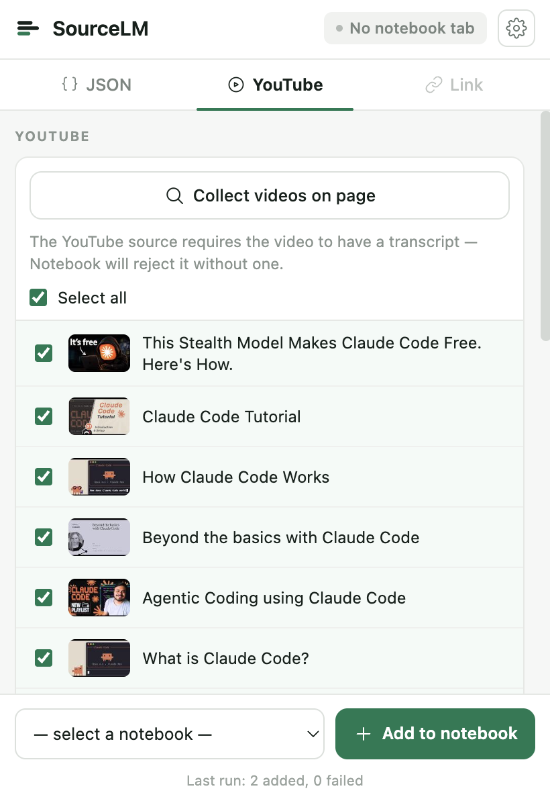
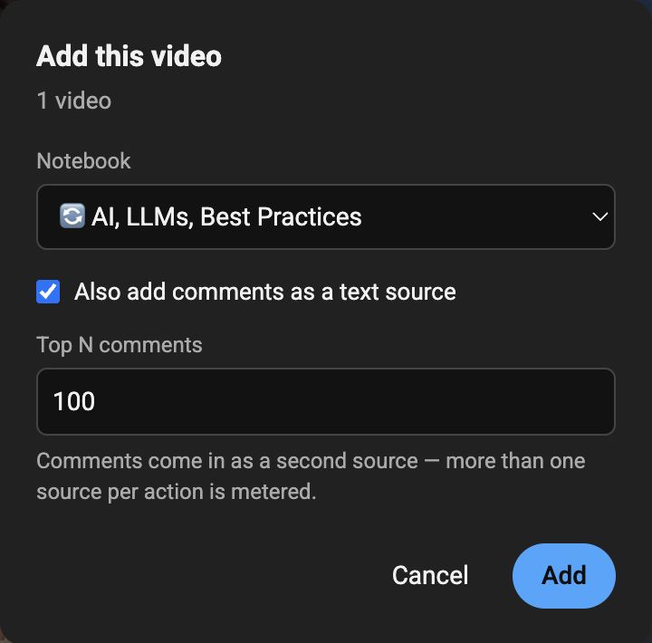

<h1 align="center">Source LM</h1>

<p align="center">
  <b>Bulk sources into NotebookLM, straight from the browser.</b><br>
  JSON datasets, YouTube playlists, link lists and web pages — added as
  sources to your own notebook. No downloads, no backend, no account.
</p>

<p align="center">
  
  
  
  
</p>

<p align="center">
  
  
</p>

---

NotebookLM takes sources one at a time, through a file picker. Source LM
takes the batch: a 40 MB JSON export becomes a handful of Markdown files
packed to the word limit and uploaded in place; a playlist becomes one
source per video; a list of links becomes a list of sources. Nothing is
written to disk — files are built as `File` objects in memory and sent
through the notebook page's own upload endpoint.

## What it does

| Source | How |
|---|---|
| **JSON dataset** | Pick a `.json`, Preview shows the packing, Upload sends it. Records are never split across files; re-running adds only what's new. |
| **YouTube video, playlist, channel** | "Add to notebook" buttons inside YouTube's own UI, or pick videos from the popup. |
| **YouTube comments** | Top comment threads with replies, as a separate Markdown source. |
| **Any web page** | Paste one link or a whole list. Pages NotebookLM can't fetch (login-walled, JS-rendered) are captured as Markdown from the tab you have open. |
| **Selected text** | Select, right-click, "Add selection to Notebook", pick a notebook. |

And on the notebook page itself: filter the Sources list, select duplicates,
delete checked sources in one batch, find and re-capture broken sources.

## Install

**From the Chrome Web Store** — the listing is in review; the link lands
here when it's live.

**From source:**

```bash
npm install
npm run build
```

Then `chrome://extensions` → **Developer mode** → **Load unpacked** → pick
this folder.

## Use it

1. Open a notebook at [notebooklm.google.com](https://notebooklm.google.com/)
   and keep the tab open — the upload runs in that tab.
2. Open the extension popup.
3. Pick a `.json` file → **Preview** → check file count, sizes, names and
   warnings → **Upload to Notebook**.

Progress, errors and confirmations show up in the popup while it runs.

### YouTube

"Add to notebook" buttons are injected into YouTube's own UI: the watch
page's actions row (between Subscribe and Like), the watch page's playlist
panel header, and a playlist page's header row. One click opens a small
dialog — pick an existing notebook or create one, then Add. The job is
written to `chrome.storage.local`, a notebook tab opens, and the content
script runs it with progress in an on-page toast.

- The notebook list comes from a cache the notebook tab writes
  (`notebookCache`) — a content script on youtube.com can't reach the
  notebook tab directly. Open NotebookLM once to populate it; until then
  only "new notebook" is offered.
- Playlists are read from the DOM, which lazy-loads: only videos already
  rendered get added. The dialog shows the count — scroll a long playlist
  first if it looks low.
- **Also add comments as a text source** collects the top comment threads
  with their replies as a second source, `[youtube]-comments-<title>.md`.
  Two sources in one click, so it counts as a bulk action; the video alone
  is free. Comments can also go in alone (popup → YouTube tab → **Add
  comments as .md**), which stays free.
- If YouTube changes its markup and a button doesn't appear, the popup flow
  (extension icon → YouTube tab → Collect videos) still works.

### Links, pages and selections

The popup's **Link** tab is enabled on any regular `http(s)` page:

- **Add link** — paste a URL or a whole list, one per line (junk lines and
  duplicates are dropped); prefilled with the active tab. NotebookLM fetches
  each page itself. More than one link in a click is a bulk action; one link
  is free.
- **Add current page** — for pages NotebookLM can't fetch. The text is read
  from the tab (`<article>`/`<main>`, else `<body>`), turned into Markdown in
  the popup and uploaded through the same path as JSON. Markdown rather than
  PDF on purpose: a browser-made PDF is a picture of the page with no text
  layer, which is a worse source than the text.
- **Selected text** — select, right-click, **"Add selection to Notebook"**,
  pick a notebook from the submenu. Same `[host]-<title>.md` source with
  `scope: "selection"` in the frontmatter. Always one source, always free.

### On the notebook page

- **Filter box** next to "Sort sources" — type a few letters, non-matching
  rows hide. Hiding never unchecks: a hidden-but-checked source still shows
  up in the delete confirmation.
- **Select duplicate sources** — looks sources up over RPC and checks only
  the repeats (same URL ignoring a trailing slash, or same title for uploads
  with no URL). It selects and nothing more.
- **Trash-can button** — deletes whichever sources are checked, in one batch,
  after a confirmation listing the count and titles. Deletion is permanent
  and NotebookLM checks every source by default, hence the prompt.
- **Broken sources** (the plaster icon) — lists links NotebookLM failed to
  fetch. "Open page" opens one in a tab; open the extension there and
  **Add page as .md** captures it and replaces the broken source. The old
  source is deleted only after the new one uploads successfully. The
  hand-off expires after five minutes. Errored YouTube sources are listed
  but can't be fixed this way — there's no page to capture.

## Chunking

Records are packed in order until a **words per file** budget is hit — one
slider in Advanced, 10,000 to 500,000 words (default 400,000). A record
longer than the budget gets its own file, whole, plus a warning. Records are
never split.

Title, date, tags and metadata fields are detected automatically; "Content
fields" in Advanced overrides which fields become the body.

Default preset — **NotebookLM Optimal**:

| Parameter | Value |
|---|---|
| `max_words_per_file` | `400000` |
| `content_fields` | `auto` |
| `metadata` | `true` |
| `filename_pattern` | `{source}-{index}-{cursor}-{title_slug}.md` |
| `source_name` | auto-detected from the JSON |

With **"Don't re-upload what's already in the notebook"**, Preview reads the
source names already in the open notebook to work out how many files exist
and which record was uploaded last, then builds only what's new. There is no
local state: delete sources by hand and they're back in the queue on the next
Preview. If the source list can't be fetched, everything is shown with a
warning — duplicates still get filtered by name at upload time.

Moving the words-per-file slider between runs does *not* force a full
re-upload; new records are found by the cursor of the last uploaded record.
Changing the filename prefix (or `source_name`) does: old names stop parsing,
the cursor can't be found, everything re-uploads. The
`-{index}-{cursor}-{title_slug}.md` tail is fixed and can't be edited — it's
what makes reconciliation possible.

## NotebookLM limits

- **50 sources** per notebook on the free plan, **300** on Pro.
- **500,000 words or 200 MB per source**, whichever comes first — the same
  cap on every plan (a higher tier buys more sources, not bigger ones). For
  Markdown the word cap is what binds; 500k words never approaches 200 MB.

Preview warns before you hit Upload — too many files, a suspiciously large
file, empty content.

All files travel from the popup to the content script in a single
`chrome.tabs.sendMessage`, and upload in batches of 10. For very large
exports that message gets big; messaging holds up to tens of MB in practice,
but if Upload doesn't start on a giant JSON with no error in Preview, lower
the words per file or split the JSON.

## Free and Pro

**Free** — one source at a time (a link, the current page, a single YouTube
video), source deletion, filtering, duplicates, broken-source fixes, and
Preview. Plus **5 bulk actions per calendar month**, shared between a full
JSON upload and selecting more than one YouTube video; the count resets on
the 1st.

**Pro** — the same bulk actions, unmetered. One-time purchase, **not a
subscription**: pay once, keep the license. Sold through Polar, which is the
merchant of record; the "Get Pro" button in the popup opens the checkout with
the current price.

To activate, paste the license key into the popup. The extension calls Polar's
public license API directly from your browser — no account, no sign-in, just
the key. Moving to another browser: deactivate on the old device first
to free the slot.

Validation runs on activation and roughly every 7 days. It **fails open** —
if the network is down or Polar is unreachable, Pro keeps working (30-day
grace window). Only an explicit "this key is invalid" turns it off.
Offline use is unaffected.

## Privacy

JSON is parsed and split into Markdown entirely in the browser, inside the
popup. Data leaves the extension only toward
`notebooklm.google.com`/`notebook.google.com` — the service you're already
signed into — and only after an explicit click. There is **no backend of
ours**: no proxy, no logging server, no telemetry. Your Google session
cookies never leave your browser. The only third-party call is to Polar's
public license API, and it carries nothing but the license key and an
activation id.

Details of what is read and what is never collected: [`PRIVACY.md`](./PRIVACY.md).

## If uploading stops working

The upload goes through two paths, in this order.

**Path 1 (primary) — the private Google RPC `batchexecute`.**
`src/content/rpc.ts` reimplements the protocol the NotebookLM / Gemini
Notebook web UI is built on (`POST <origin>/_/LabsTailwindUi/data/batchexecute`)
and calls it directly, bypassing the DOM: file registration (RPC `o4cbdc` →
`SOURCE_ID`), a resumable upload session (`x-goog-upload-command: start`,
upload URL returned in the `x-goog-upload-url` header), then the content
upload with `x-goog-upload-command: upload, finalize`. Notebook operations
(`src/content/notebook.ts`) use the same transport with different rpc-ids
(`wXbhsf`, `CCqFvf`, `izAoDd`/`ozz5Z`).

This is not a documented API — Google can change the `rpcid`, request format
or headers without notice. If the RPC starts failing:

- Open DevTools → Network on the notebook page, do the same action by hand
  (add a source), and compare the `rpcid`/request body against what
  `rpc.ts`/`notebook.ts` sends. Usually only an id or the shape of one
  parameter changed.
- Capture a working request before changing anything: the notebook page
  performing the action by hand is the only reliable specification of this
  protocol. Diff that capture against the request `rpc.ts` builds, then fix
  the one field that moved.
- `addYoutubeSource` already survives one known failure mode, an rpc-id
  change (`izAoDd` → `ozz5Z`): it auto-detects the working version and caches
  it. A third version means extending that detection.

**Path 2 (fallback) — DOM injection.** `uploader.ts` switches on the first
RPC failure, and the rest of that upload session goes through the DOM. The
ladder: find `input[type=file]` in the DOM/shadow DOM → click "Add source"
by its text → feed files via `DataTransfer` → fall back to drag-and-drop.
Selectors match visible text, never CSS classes (Angular obfuscates those and
they rot between releases) — which reduces, not eliminates, breakage after a
redesign.

Both paths are kept on purpose: they break for different reasons — RPC from a
protocol change, DOM from a layout redesign.

**Plan B (unused).** `chrome.scripting.executeScript({ world: 'MAIN' })` runs
in the page's own context. Needed only if both paths fail at once. `File`
objects can't cross `executeScript` arguments, so the Markdown would travel
as a string and the `File` be built inside the MAIN world. `scripting` is
already in the manifest (it powers page capture), so this needs a different
call, not a new permission.

**Known authentication limit.** `invalidateTokens()` in `rpc.ts` makes the
next call re-read CSRF/session tokens from the page's HTML — but NotebookLM
is an SPA: if the session expired, the loaded HTML doesn't refresh and the
same stale token comes back. The only working retry is reloading the tab
(`AUTH_EXPIRED_MESSAGE`).

## Development

```bash
npm run watch      # esbuild, rebuild on change
npm test           # node --test test/convert.test.mjs
npx tsc --noEmit
```

Four entry points build into `dist/`: `popup.ts`, `uploader.ts` →
`dist/content.js`, `youtube.ts`, `background.ts`. Minification is off on
purpose — Chrome Web Store review requires that functionality be discernible
from the submitted code.

### Releases

Copy `.env.example` to `.env` and fill in the real Polar values before a
release build (`npm run build` inlines them; without `.env` the fallbacks in
`license.ts` apply). The release workflow reads the same values from
repository Variables (`SOURCE_LM_CHECKOUT_URL`, `SOURCE_LM_POLAR_ORG_ID`,
`SOURCE_LM_PRICE_LABEL`, `SOURCE_LM_FREE_QUOTA`) and refuses to build without
them — or to build at all if `SOURCE_LM_POLAR_API` still points at the Polar
sandbox.

To cut one: bump the version to the same value in `manifest.json` and
`package.json`, commit, `git tag vX.Y.Z && git push --tags`. GitHub Actions
runs the tests, builds, and attaches `source-lm-vX.Y.Z.zip` to the release.
That zip goes to the Chrome Web Store by hand — there's no automated publish
step.

## License

Source-available, not open source: [PolyForm Noncommercial
1.0.0](./LICENSE.md). Read it, audit it, build it, run it for yourself — all
fine. Commercial use, including publishing it or a derivative to an extension
store, is not licensed.

Contributions welcome under [CONTRIBUTING.md](./CONTRIBUTING.md); security
reports go through [SECURITY.md](./SECURITY.md). Work this project derives
from is credited in [THIRD_PARTY_NOTICES.md](./THIRD_PARTY_NOTICES.md).

"Source LM" is a trademark of Mikhail Konkov; the license grants no trademark
rights. Source LM is an independent project, not affiliated with, endorsed by,
or sponsored by Google LLC. NotebookLM, Gemini Notebook, Gemini and YouTube
are trademarks of Google LLC.
